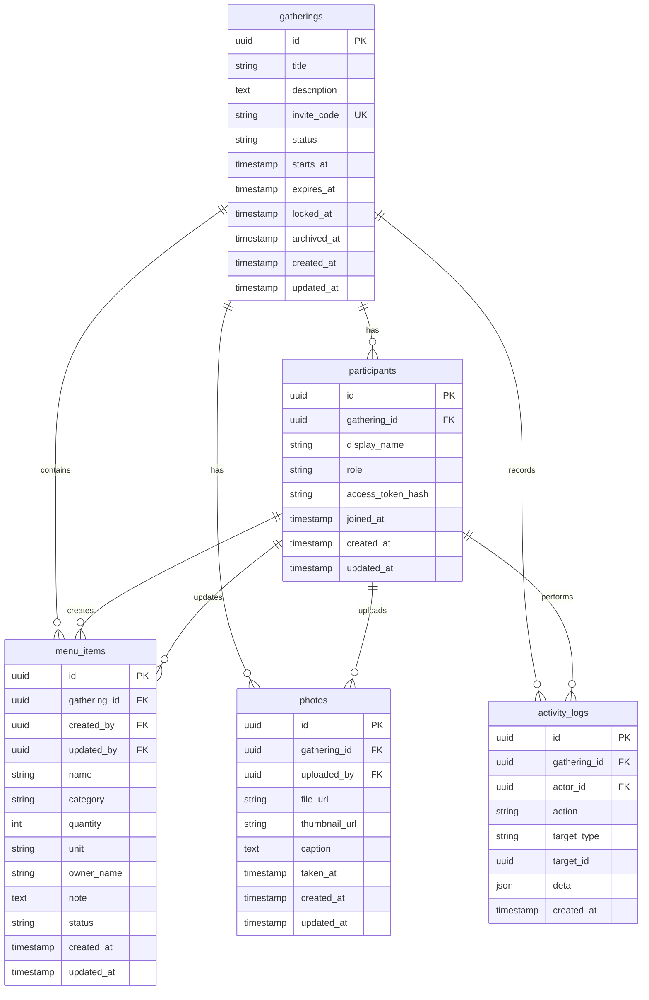

# LetsOrder

LetsOrder is a lightweight family gathering menu collaboration system. A host creates a gathering, shares an invitation URL, and invited family members can help build and refine the menu together. After the menu editing window expires, the gathering becomes read-only for menu changes and turns into a place for photos, notes, and later memories.

## Product Goals

- Let a host start a one-off family gathering from a simple web flow.
- Generate a shareable invitation URL for participants.
- Allow invited participants to add and edit menu items for the current gathering.
- Prevent destructive edits: participants can update or cancel menu items, but cannot delete them.
- Lock menu editing automatically when the gathering expires.
- Preserve the final menu as part of the gathering history.
- Allow photo uploads after the gathering for review and memory keeping.
- Keep the first version simple enough to run locally or on a small home server.

## Technical Stack

### Backend

- Language: Rust
- Web framework: Axum
- Async runtime: Tokio
- Database: SQLite for MVP
- Database access: SQLx
- Serialization: Serde
- API style: REST first, WebSocket or SSE later for live updates

### Frontend

- Framework: React
- Build tool: Vite
- Language: TypeScript
- Routing: React Router
- Styling: Tailwind CSS
- Data fetching: TanStack Query or a small fetch wrapper for MVP

### Storage

- MVP photo storage: local filesystem
- Later photo storage: S3-compatible object storage, Cloudflare R2, or similar

### Local Toolchain Check

Checked on 2026-07-02:

- Rust: installed (`rustc 1.91.1`, `cargo 1.91.1`)
- Node.js: installed (`v26.0.0`)
- npm: installed (`11.12.1`)
- SQLite: installed (`3.51.0`)
- pnpm: not installed
- Yarn: not installed
- SQLx CLI: not installed
- SeaORM CLI: not installed

The project can start with npm. If SQLx migrations are used from the command line, install `sqlx-cli` later.

## Main Concepts

- Gathering: one family event or meal planning session.
- Invitation URL: a shareable link generated by the host.
- Participant: a person who joins through the invitation URL.
- Menu Item: a dish, drink, dessert, snack, or preparation task for the gathering.
- Review: the post-event view containing the final menu and uploaded photos.
- Activity Log: an append-only audit trail of important collaborative actions.

## Main Modules

### Gathering Management

- Create a gathering.
- Set title, description, start time, and menu expiration time.
- Generate and share an invitation code.
- Lock or archive the gathering.

### Participant Join Flow

- Open invitation URL.
- Enter display name.
- Join the gathering as a participant.
- Store a participant access token locally in the browser.

### Collaborative Menu

- View the current menu.
- Add menu items.
- Edit existing menu items.
- Mark menu items as planned, prepared, or cancelled.
- Keep cancelled items instead of deleting them.
- Lock editing after the gathering expires.

### Review and Photos

- Show the final menu after expiration.
- Upload photos.
- Add captions.
- Browse uploaded photos later.

### Admin and Host Tools

- View participants.
- Edit gathering metadata.
- Extend or shorten the menu expiration time.
- Manually lock the menu.
- Review activity logs.

## Main Workflows

### 1. Host Creates a Gathering

```text
Host opens create page
  -> enters gathering details
  -> backend creates gathering and host participant
  -> backend generates invite code
  -> frontend shows shareable invitation URL
```

### 2. Participant Joins by URL

```text
Participant opens /menu/:inviteCode
  -> frontend loads gathering summary
  -> participant enters display name
  -> backend creates participant
  -> frontend stores participant token
  -> participant enters collaborative menu page
```

### 3. Participants Maintain the Menu

```text
Participant views menu
  -> adds a dish or edits an existing one
  -> backend checks gathering is still active
  -> backend saves change
  -> backend writes activity log
  -> frontend refreshes menu
```

### 4. Menu Editing Expires

```text
Current time passes expires_at
  -> backend treats gathering as locked
  -> menu add/edit APIs reject changes
  -> frontend switches menu page to read-only mode
  -> review and photo upload remain available
```

### 5. Post-Gathering Review

```text
Participant opens review page
  -> sees final menu
  -> uploads photos
  -> adds optional captions
  -> photos become part of the gathering archive
```

## API Draft

### Gatherings

```http
POST   /api/gatherings
GET    /api/gatherings/:inviteCode
PATCH  /api/gatherings/:gatheringId
POST   /api/gatherings/:gatheringId/lock
POST   /api/gatherings/:gatheringId/archive
```

### Participants

```http
POST   /api/gatherings/:gatheringId/participants
GET    /api/gatherings/:gatheringId/participants
```

### Menu Items

```http
GET    /api/gatherings/:gatheringId/menu-items
POST   /api/gatherings/:gatheringId/menu-items
PATCH  /api/menu-items/:menuItemId
```

Menu items should not have a public delete endpoint in the MVP. Use `status = cancelled` instead.

### Photos

```http
GET    /api/gatherings/:gatheringId/photos
POST   /api/gatherings/:gatheringId/photos
PATCH  /api/photos/:photoId
```

### Activity Logs

```http
GET    /api/gatherings/:gatheringId/activity-logs
```

## Database ER



## Suggested Repository Layout

```text
backend/
  src/
    main.rs
    config.rs
    db.rs
    errors.rs
    routes/
    models/
    services/
  migrations/
  Cargo.toml

frontend/
  src/
    api/
    components/
    pages/
    types/
    main.tsx
    App.tsx
  package.json

README.md
```

## Getting Started

### Start Everything

Run the backend and frontend together:

```bash
./scripts/dev.sh
```

Default local URLs:

- Frontend: `http://localhost:5173`
- Backend: `http://localhost:8080`
- Health check: `http://localhost:8080/health`

The script installs frontend dependencies when `frontend/node_modules` is missing. Press `Ctrl+C` to stop both servers.

### Start Backend Only

```bash
./scripts/backend.sh
```

Optional overrides:

```bash
PORT=18080 DATABASE_URL="sqlite:///tmp/letsorder.db?mode=rwc" ./scripts/backend.sh
```

### Start Frontend Only

```bash
./scripts/frontend.sh
```

The frontend dev server listens on `http://localhost:5173` and proxies backend data requests such as `/api/gatherings` and `/api/menu-items`.

Optional override:

```bash
FRONTEND_PORT=5174 ./scripts/frontend.sh
```

### Run Checks

```bash
./scripts/check.sh
```

This runs `cargo fmt --all --check`, `cargo check`, and `npm run build`.

## MVP Milestones

1. Create gathering and invite URL.
2. Join gathering as a participant.
3. Add and edit menu items.
4. Lock menu editing after expiration.
5. Show read-only review page.
6. Upload and browse gathering photos.

## Future Ideas

- Live menu updates with WebSocket or SSE.
- QR code generation for invitation links.
- Shopping list view derived from menu items.
- Voting or emoji reactions for menu items.
- Host-only moderation for photo captions.
- S3-compatible storage for production photo uploads.
