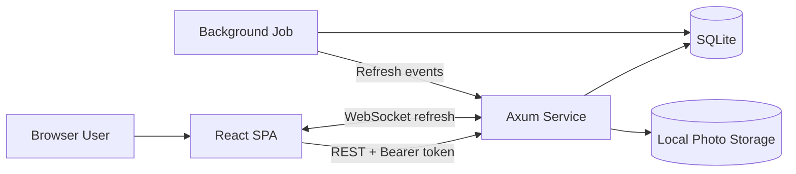
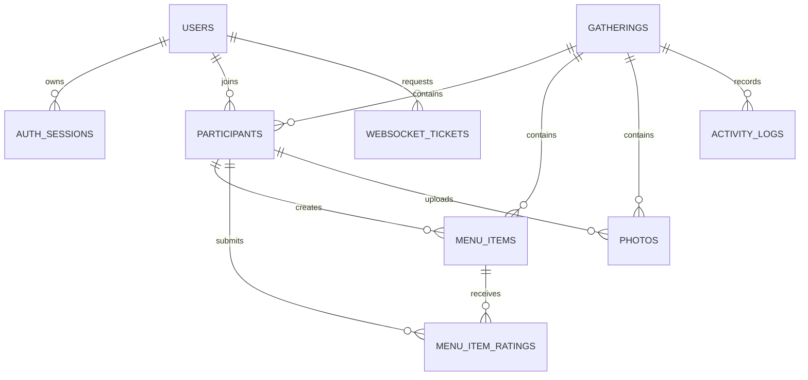
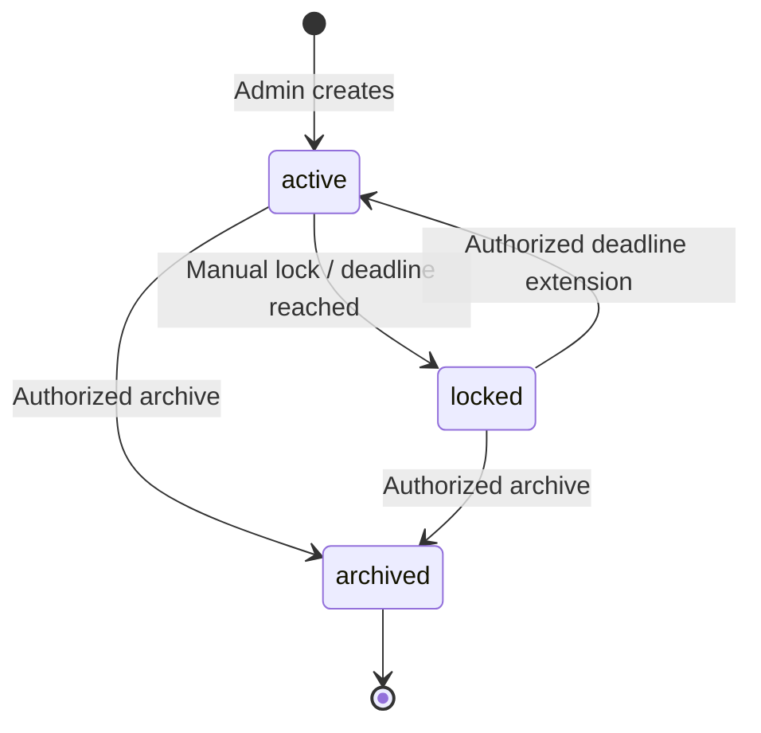
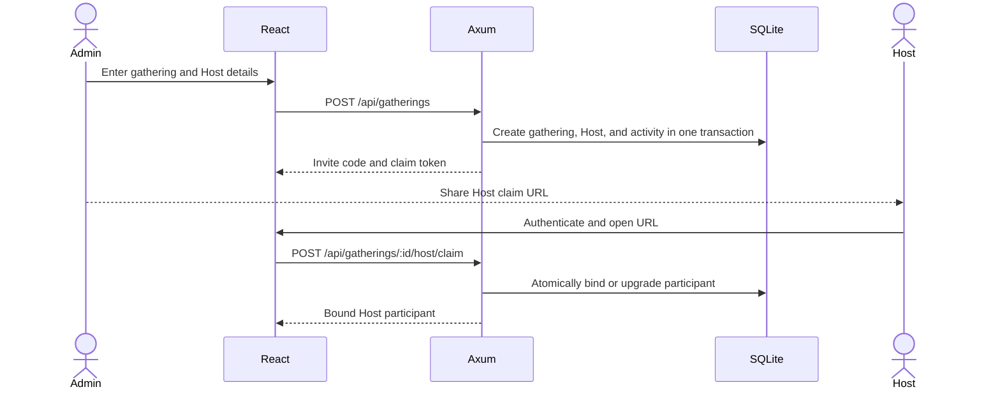

# LetsOrder Service Design

Document version: 1.0

Last updated: 2026-07-25

Code baseline: `b676970`

## 1. Purpose

This document describes the current LetsOrder service design. It is the shared
technical baseline for implementation, testing, deployment, and future
evolution. It documents behavior that exists in the current codebase. Proposed
changes are listed separately under constraints and evolution paths and are not
part of the current API contract.

## 2. Product Scope

LetsOrder is a collaborative menu-planning service for family gatherings and
small events. An administrator creates a gathering and shares an invitation. A
Host claims management access, participants maintain the menu together, and the
gathering moves into a read-only review phase after the editing deadline.
Participants can then rate dishes and upload photos.

The current release includes:

- Local account registration, login, account settings, and administrator member
  management.
- Gathering creation, invitation-based joining, Host claiming, deadline
  management, locking, reopening, and archiving.
- Menu item creation, editing, cancellation, status management, and optimistic
  concurrency handling.
- Post-lock ratings and historical Chef recommendations.
- Automatic expiry locking, activity logs, and realtime refresh.
- Post-lock photo upload, protected photo access, and administrator maintenance.
- Single-machine or small home-server deployment.

The current release does not target:

- Public multi-tenant SaaS operation.
- Strongly consistent multi-node deployment.
- Large-scale media storage and processing.
- External identity providers, email-based password recovery, or organizational
  RBAC.
- Offline editing or durable event-stream synchronization.

## 3. Design Principles

1. **Separate identity from display names.** Authorization uses immutable user
   IDs and roles, never editable display names.
2. **Enforce gathering isolation.** Regular users can access only gatherings
   they have joined. Administrators have a global management view.
3. **Drive writes from gathering state.** Menu editing is available only while a
   gathering is active and unlocked. Ratings and photos are available after
   locking.
4. **Use database constraints as the authority.** SQLite constraints enforce
   uniqueness and referential integrity; the service converts conflicts into
   domain-specific errors.
5. **Commit related writes atomically.** Gathering creation, registration,
   joining, menu changes, and photo metadata writes use transactions.
6. **Use realtime events as refresh hints.** WebSocket messages do not carry
   authoritative entities. Clients always reload current state through REST.
7. **Keep MVP operations simple.** The deployment uses one Rust service, SQLite,
   and local file storage while retaining clear future replacement boundaries.

## 4. System Context



The React single-page application communicates with an Axum backend. The
backend exposes REST APIs, WebSocket refresh events, protected photo delivery,
and a health endpoint. SQLx applies migrations when establishing the database
connection.

## 5. Technology Stack

| Layer | Current technology |
| --- | --- |
| Frontend | React 19, TypeScript, React Router, TanStack Query, Vite |
| Backend | Rust 2024, Axum 0.8, Tokio, Serde |
| Data access | SQLx 0.8 |
| Database | SQLite |
| Password security | Argon2 with legacy SHA-256/FNV migration support |
| Realtime | Axum WebSocket and Tokio broadcast |
| Image processing | `image` crate and local filesystem |
| Tests | Rust integration tests and Playwright |

## 6. Code Organization

### 6.1 Backend

```text
backend/src/
  main.rs                         Startup, configuration, CORS, background jobs
  config.rs                       Environment configuration and production checks
  db.rs                           SQLite pool and migrations
  errors.rs                       Domain error to HTTP response mapping
  models/                         API, domain, and database-row models
  routes/                         HTTP/WebSocket routes and access checks
  services/auth_service.rs        Accounts, sessions, and participant helpers
  services/gathering_service/     Gatherings, menus, ratings, photos, and logs
```

The route layer parses requests, resolves the authenticated user, checks
gathering access, replaces client-supplied actor IDs with server-derived IDs,
and emits refresh notifications. The service layer owns validation,
transactions, state transitions, and database queries. The model layer owns
serialization and database-row conversion.

### 6.2 Frontend

```text
frontend/src/
  App.tsx                         Authentication state and application routing
  api/                            Typed fetch wrappers
  pages/                          Create, join, menu, Host, review, and settings
  components/                     Forms, dish cards, dialogs, and shared panels
  hooks/useRealtimeRefresh.ts     WebSocket connection and query invalidation
  utils/user.ts                   Local session storage and account-change events
  types/                          Frontend domain types
```

TanStack Query owns server state. The application clears its query cache when
the authenticated account changes so a shared browser cannot reuse data from
the previous account. A `409 Conflict` menu response is presented through the
conflict dialog with both the latest server state and the user's submission.

## 7. Domain Model

### 7.1 Core Entities

| Entity | Purpose | Important constraints |
| --- | --- | --- |
| `users` | Login identities | Unique username; role is `admin` or `user` |
| `auth_sessions` | Bearer sessions | Unique token; default lifetime is 48 hours |
| `gatherings` | Menu collaboration events | Unique invite code and controlled state |
| `participants` | User identity within a gathering | One bound row per gathering and user |
| `menu_items` | Dishes and preparation tasks | Positive quantity and revision number |
| `menu_item_ratings` | Participant dish ratings | One 1-5 rating per participant and item |
| `photos` | Gathering photo metadata | References uploader, gathering, and file URL |
| `activity_logs` | Business audit records | Append-oriented action and JSON detail |
| `websocket_tickets` | Short-lived socket credentials | Unique and atomically consumed |

### 7.2 Relationships



### 7.3 Gathering State Machine

The database permits `draft`, `active`, `locked`, and `archived`. The current
creation flow enters `active` directly; `draft` is not currently used.



Rules:

- Menu writes require `active` and `is_locked = 0`.
- Request paths synchronize expired gatherings on access. A background job also
  scans every 10 minutes and locks at most 10 expired gatherings per run.
- A locked gathering can be reopened by setting a future deadline.
- `archived` is terminal and cannot be reopened or locked again.
- Ratings, photo listing, and photo upload require a locked gathering.

## 8. Authentication and Authorization

### 8.1 Accounts and Sessions

- The system administrator username is fixed as `suite-admin`.
- Development can use the default administrator password.
  `LETSORDER_ENV=production` requires a non-default
  `LETSORDER_ADMIN_PASSWORD` of at least 12 characters.
- New and changed passwords use Argon2 with a random salt.
- Legacy password hashes remain readable and are upgraded to Argon2 after a
  successful login.
- Failed logins are counted by normalized username in process memory. Five
  failures block further attempts for 60 seconds.
- Session tokens are UUIDs stored in browser `localStorage`.
- Sessions expire after 48 hours. Logout removes the current session, and
  password changes revoke other sessions.

### 8.2 Roles

| Identity | Permissions |
| --- | --- |
| Anonymous | Health endpoint and public frontend/static assets only |
| Regular user | Login, join gatherings, and view joined gatherings |
| Participant | Edit an active menu; rate and upload photos after locking |
| Host | Participant rights plus gathering deadline, lock, and archive APIs |
| Admin | Create and manage gatherings, users, and photo metadata globally |

The frontend currently shows the main management controls only to
administrators. Host authorization exists in the backend. The product should
explicitly decide whether the full management controls should also be exposed to
claimed Hosts.

### 8.3 Host Claim Flow

1. Gathering creation inserts an unbound `host` participant.
2. The backend generates a one-time claim token and stores only its SHA-256
   digest.
3. The frontend places the token in a URL fragment so it is not sent in the
   initial HTTP request or proxy logs.
4. The intended Host authenticates and submits the claim token.
5. A transaction binds the Host row to the current user, or atomically upgrades
   an existing participant row for that user.
6. The claim cannot be reused, and a matching display name grants no authority.

### 8.4 Gathering Access

Regular users must have a participant row bound to their `user_id` before they
can read gathering details, menu items, participants, activity, ratings, or
photos. Administrators bypass this participant check. The service does not trust
client-supplied `created_by` or `updated_by` values; routes replace them with the
participant derived from the authenticated session.

## 9. Core Workflows

### 9.1 Create and Claim a Gathering



### 9.2 Join and Collaborate

1. A user enters through `/menu/:inviteCode` or `/join`.
2. The user logs in or registers with a display name. Registration returns a
   generated initial password.
3. The backend resolves the invite and idempotently creates a participant bound
   to the account.
4. Menu reads require gathering membership.
5. Menu writes validate gathering editability and participant ownership.
6. The business row, activity log, and participant activity timestamp are
   committed in a transaction.
7. The backend emits a refresh event, and clients reload affected queries.

### 9.3 Optimistic Concurrency

`menu_items.revision` starts at 1. An update supplies `expected_revision`; the SQL
update matches both ID and revision and increments the revision on success. If
no row is updated, the API returns `409 Conflict` with:

- The latest menu item.
- The submitted client payload.

The frontend lets the user load the latest version, review the changes, and save
again.

### 9.4 Lock, Rate, and Review

After manual or automatic locking:

- Menu creation and editing are rejected.
- Participants can rate each item from 1 to 5. Submitting again updates the
  existing rating.
- The Review page displays the final menu, ratings, and photos.
- Participants can upload photos.
- Administrators can update photo captions and delete photos.
- Chef recommendations aggregate only `prepared` or `done` dishes from
  gatherings visible to the caller. Administrators can query global history.

## 10. API Design

All business endpoints except login and registration use:

```http
Authorization: Bearer <session-token>
```

### 10.1 System and Authentication

| Method | Path | Access | Purpose |
| --- | --- | --- | --- |
| GET | `/health` | Public | Liveness check |
| POST | `/api/auth/login` | Public | Authenticate and create a session |
| POST | `/api/auth/register` | Public | Register, optionally joining a gathering |
| GET | `/api/auth/me` | Authenticated | Validate session and return current user |
| POST | `/api/auth/logout` | Authenticated | Revoke current session |
| PATCH | `/api/auth/account` | Authenticated | Update current account |
| GET | `/api/auth/members` | Admin | List accounts |
| PATCH | `/api/auth/members/:userId` | Admin | Update a member account |
| POST | `/api/auth/ws-ticket` | Authenticated | Create a one-minute WebSocket ticket |
| GET | `/api/ws?ticket=...` | Ticket | Open realtime refresh connection |

### 10.2 Gatherings

| Method | Path | Access | Purpose |
| --- | --- | --- | --- |
| GET | `/api/gatherings` | Authenticated | List all for Admin or joined for a user |
| POST | `/api/gatherings` | Admin | Create gathering and Host claim |
| GET | `/api/gatherings/active` | Authenticated | List active gatherings available to join |
| GET | `/api/gatherings/:inviteCode` | Member/Admin | Read gathering by invite code |
| POST | `/api/gatherings/invite/:inviteCode/participants` | Authenticated | Join by invite code |
| POST | `/api/gatherings/:gatheringId/participants` | Authenticated | Join by gathering ID |
| GET | `/api/gatherings/:gatheringId/participants` | Member/Admin | List participants |
| POST | `/api/gatherings/:gatheringId/host/claim` | User | Consume one-time Host claim |
| PATCH | `/api/gatherings/:gatheringId` | Host/Admin | Update deadline or reopen |
| POST | `/api/gatherings/:gatheringId/lock` | Host/Admin | Lock immediately |
| DELETE | `/api/gatherings/:gatheringId` | Host/Admin | Archive |
| GET | `/api/gatherings/:gatheringId/activity-logs` | Member/Admin | List activity |

### 10.3 Menu, Ratings, and Recommendations

| Method | Path | Access | Purpose |
| --- | --- | --- | --- |
| GET | `/api/gatherings/:gatheringId/menu-items` | Member/Admin | List menu |
| POST | `/api/gatherings/:gatheringId/menu-items` | Member | Create item |
| PATCH | `/api/menu-items/:menuItemId` | Member | Revision-checked update |
| GET | `/api/gatherings/:gatheringId/menu-ratings` | Member/Admin | Rating summary and own rating |
| POST | `/api/menu-items/:menuItemId/rating` | Member | Rate after locking |
| GET | `/api/chefs/:chefName/dish-recommendations` | Authenticated | Query visible history |

Menu items have no physical delete endpoint. `status = cancelled` preserves
history.

### 10.4 Photos

| Method | Path | Access | Purpose |
| --- | --- | --- | --- |
| GET | `/api/gatherings/:gatheringId/photos` | Member/Admin | List photos after locking |
| POST | `/api/gatherings/:gatheringId/photos` | Member | Upload after locking |
| GET | `/resources/uploads/:filename` | Member/Admin | Read after gathering check |
| PATCH | `/api/photos/:photoId` | Admin | Update caption |
| DELETE | `/api/photos/:photoId` | Admin | Delete metadata and local file |

Uploads are limited to 8 MiB. PNG, JPEG, WebP, and GIF are supported. The
extension must match the decoded content, and neither image dimension may exceed
12,000 pixels.

### 10.5 Error Semantics

| HTTP status | Meaning |
| --- | --- |
| 400 | Request validation failed |
| 401 | Session or WebSocket ticket is invalid or expired |
| 403 | Access denied or current state does not permit the action |
| 404 | Resource not found |
| 409 | Revision conflict, invalid transition, or consumed claim |
| 429 | Too many login attempts |
| 500 | Database or unclassified server error |

## 11. Realtime Refresh

WebSocket authentication uses a separate one-minute ticket so a long-lived
Bearer token is never placed in a URL.

1. The frontend calls `/api/auth/ws-ticket`.
2. The backend validates the session and stores a ticket.
3. The WebSocket handshake uses atomic `DELETE ... RETURNING`, so only one
   consumer can authenticate.
4. The backend subscribes to an in-process broadcast channel with capacity 128.
5. Regular users receive only events for joined gatherings; administrators
   receive all events.
6. A `refresh` event invalidates gathering, menu, rating, participant, activity,
   and photo queries.
7. On failure, the frontend requests a fresh ticket and reconnects with
   exponential backoff from 1 to 30 seconds.
8. Broadcast lag is logged and skipped without closing the socket.

This is eventually consistent refresh signaling, not a durable message queue.
The database remains authoritative.

## 12. Consistency and Concurrency

- SQLite foreign keys and a busy timeout are enabled.
- A partial unique index permits at most one bound participant per user and
  gathering.
- Concurrent joining and username allocation use constraints with bounded retry.
- WebSocket tickets are atomically consumed.
- Menu revisions prevent silent overwrites.
- Related database writes use SQLx transactions.
- Failed photo writes and failed metadata commits remove the newly created file.
- Activity logs are committed with their primary business mutation where
  practical.

## 13. Media Storage

`LETSORDER_RESOURCE_DIR` selects the resource root; the service otherwise prefers
`backend/resources`. Uploaded files use random photo UUID names, and the database
stores a relative URL.

`/resources/mock` is public. `/resources/uploads/:filename` resolves the photo's
gathering and checks membership before reading the file. The filesystem and
database do not provide a distributed transaction. File deletion is therefore
best effort, and operations should periodically detect orphaned files.

## 14. Configuration and Deployment

### 14.1 Environment Variables

| Variable | Default | Purpose |
| --- | --- | --- |
| `DATABASE_URL` | `sqlite://letsorder.db?mode=rwc` | SQLite connection |
| `PORT` | `8080` | Backend listen port |
| `LETSORDER_ENV` | Non-production | Enables production checks when `production` |
| `LETSORDER_ADMIN_PASSWORD` | Development default | Required and validated in production |
| `LETSORDER_ALLOWED_ORIGINS` | Local frontend origins | Comma-separated CORS origins |
| `LETSORDER_RESOURCE_DIR` | Auto-detected | Mock and upload resource root |
| `VITE_API_BASE_URL` | Same origin | Frontend REST/WebSocket base |
| `FRONTEND_PORT` | `5173` | Local frontend script port |
| `RUST_LOG` | Service debug | Tracing filter |

### 14.2 Local Operation

Start the complete development environment:

```bash
./scripts/dev.sh
```

This stops stale local processes and clears the development SQLite database
before starting Axum and Vite. To preserve data, run the services separately:

```bash
./scripts/backend.sh
./scripts/frontend.sh
```

Run all checks:

```bash
./scripts/check.sh
```

The check script runs Rust formatting, compilation, Clippy, tests, frontend lint,
build, and Playwright.

### 14.3 Single-Machine Production Topology

Use a reverse proxy for TLS and forward `/api`, `/health`,
`/resources/uploads`, and `/api/ws` to Axum. The built frontend can be hosted
separately by the proxy. The SQLite file and resource directory must be mounted
on persistent storage and included in one backup and recovery procedure.

## 15. Observability and Background Work

- `TraceLayer` records HTTP requests.
- `tracing` records startup, auto-lock counts, ticket cleanup failures, and
  broadcast lag.
- `/health` currently provides liveness only.
- Every 10 minutes the background task:
  - Locks at most 10 expired gatherings in deadline order.
  - Sends refresh events for changed gatherings.
  - Deletes expired unused WebSocket tickets.

Metrics, distributed tracing, dependency readiness, and alerting are not yet
implemented.

## 16. Test Strategy

The current suite includes:

- Rust API integration coverage for authentication, permissions, Host claiming,
  concurrent joining, username allocation, menu conflicts, recommendation
  isolation, photo access, state transitions, WebSocket tickets, and CORS.
- Playwright coverage for unauthenticated route protection, menu conflicts,
  Host page boundaries, and unavailable gathering states.
- Rust formatting, Clippy, TypeScript compilation, frontend build, and ESLint
  quality gates.

New work should include:

- Success and permission-denied API paths.
- Concurrency tests for state, uniqueness, or revision-sensitive writes.
- Isolation tests for cross-account or cross-gathering data.
- Playwright coverage for critical user-visible workflows.

## 17. Constraints and Evolution Paths

1. **Single-process state:** Login throttling and realtime broadcast are
   process-local. Multi-instance deployment requires shared coordination.
2. **SQLite write concurrency:** Appropriate for low traffic; sustained write
   growth should trigger a PostgreSQL evaluation.
3. **Local photo storage:** Unsuitable for elastic instances; introduce an
   S3-compatible storage abstraction when required.
4. **Bearer token storage:** Session tokens are stored in plaintext in the
   database and browser `localStorage`. Public deployment should evaluate token
   digests, HttpOnly cookies, and CSP.
5. **Rate-limit scope:** The current limiter is username-only and process-local.
   Public deployment should add client IP and proxy-layer protection.
6. **Health semantics:** The health endpoint does not check database or
   filesystem readiness.
7. **Host frontend capability:** The backend authorizes Hosts, but the product
   must decide which management controls to expose in the UI.
8. **Audit lifecycle:** Activity logs do not have retention, archival, or privacy
   deletion policies.

Planned work is tracked in `docs/DEVELOPMENT_PLAN.md`.
